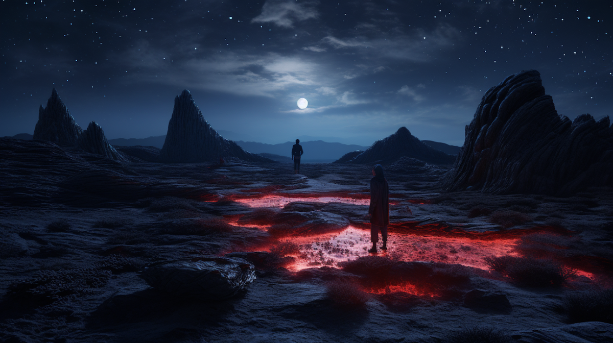

```{r setup, include=FALSE}
usethis::use_git_ignore(c("*.csv", "*.rds"))
options(htmltools.dir.version = FALSE)

library(knitr)
library(tidyverse)
library(xaringan)
library(fontawesome)
```

class: inverse, center, middle

# `r fa("fas fa-images", fill = "#fff")`

**View the slides:** 

[bretsw.com/meche24](https://bretsw.com/meche24/)

---

class: inverse, center, middle

# `r fa("fas fa-mountain-sun", fill = "#fff")` <br><br> Problem-Solving <br> as a Journey

---

# `r fa("fas fa-mountain-sun", fill = "#fff")` Problem-Solving as a Journey

```{r, out.width = "100%", echo = FALSE, fig.align = "center"}
include_graphics("img/SDL.png")
```

--

### Self-Directed Learning

---

# `r fa("fas fa-mountain-sun", fill = "#fff")` Problem-Solving as a Journey

```{r, out.width = "100%", echo = FALSE, fig.align = "center"}
include_graphics("img/SDL.png")
```

### Self-Directed Learning: Macro

---

# `r fa("fas fa-mountain-sun", fill = "#fff")` Problem-Solving as a Journey

```{r, out.width = "100%", echo = FALSE, fig.align = "center"}

```

### Self-Directed Learning: Micro

---

# `r fa("fas fa-mountain-sun", fill = "#fff")` Problem-Solving as a Journey

```{r, out.width = "100%", echo = FALSE, fig.align = "center"}

```

### What is your typical problem-solving process?

---

# `r fa("fas fa-mountain-sun", fill = "#fff")` Problem-Solving as a Journey

```{r, out.width = "100%", echo = FALSE, fig.align = "center"}

```

### How will you be expected to solve problems in your career?

---

# `r fa("fas fa-mountain-sun", fill = "#fff")` Problem-Solving as a Journey

```{r, out.width = "100%", echo = FALSE, fig.align = "center"}

```

### Self-Directed Learning

---

# `r fa("fas fa-mountain-sun", fill = "#fff")` Problem-Solving as a Journey

```{r, out.width = "100%", echo = FALSE, fig.align = "center"}

```

### Self-Directed Learning: **1. Performance Objective/Outcome**

---

# `r fa("fas fa-mountain-sun", fill = "#fff")` Problem-Solving as a Journey

```{r, out.width = "100%", echo = FALSE, fig.align = "center"}

```

### Self-Directed Learning: **2. Starting Context**

---

# `r fa("fas fa-mountain-sun", fill = "#fff")` Problem-Solving as a Journey

```{r, out.width = "100%", echo = FALSE, fig.align = "center"}

```

### Self-Directed Learning: **3. Practice Opportunities**

---

# `r fa("fas fa-mountain-sun", fill = "#fff")` Problem-Solving as a Journey

```{r, out.width = "100%", echo = FALSE, fig.align = "center"}

```

### Self-Directed Learning: **4. Difficulty Level**

---

# `r fa("fas fa-mountain-sun", fill = "#fff")` Problem-Solving as a Journey

```{r, out.width = "100%", echo = FALSE, fig.align = "center"}

```

### Self-Directed Learning: **5. Content Area**

---

# `r fa("fas fa-mountain-sun", fill = "#fff")` Problem-Solving as a Journey

```{r, out.width = "100%", echo = FALSE, fig.align = "center"}

```

### Self-Directed Learning: **6. External Guide**

---

# `r fa("fas fa-mountain-sun", fill = "#fff")` Problem-Solving as a Journey

1. `r fa("far fa-circle-dot", fill = "#782F40")` Identify Performance Objective/Outcome

2. `r fa("fas fa-house-user", fill = "#782F40")` Assess Starting Context

3. `r fa("fas fa-person-walking", fill = "#782F40")` Maximize Practice Opportunities

4. `r fa("fas fa-gauge-high", fill = "#782F40")` Monitor Difficulty Level

5. `r fa("fas fa-cubes-stacked", fill = "#782F40")` Explore Content Area

6. `r fa("fas fa-people-arrows", fill = "#782F40")` Find External Guides

---

class: inverse, center, middle

# `r fa("far fa-circle-dot", fill = "#fff")`  <br><br> 1. Objective/Outcome

---

# `r fa("far fa-circle-dot", fill = "#fff")` 1. Objective/Outcome

```{r, out.width = "100%", echo = FALSE, fig.align = "center"}
include_graphics("img/1-mountain-summit.png")
```

--

### Journey into the new and unknown

---

# `r fa("far fa-circle-dot", fill = "#fff")` 1. Objective/Outcome

```{r, out.width = "100%", echo = FALSE, fig.align = "center"}
include_graphics("img/1-mountain-summit.png")
```

### Engineers are creators: Engineer [verb] something new

---

class: inverse, center, top

# `r fa("far fa-circle-dot", fill = "#fff")` <br><br> 1. Performance Objective/Outcome <br><br> `r fa("fas fa-person-falling", fill = "#fff")` Perils

<hr>

--

**Lack of self-reflection `r fa("fas fa-arrows-left-right", fill = "#fff")` Analysis paralysis**

<hr>

--

`r fa("fas fa-person-falling", fill = "#fff")` Unclear goals: lack of direction

--

`r fa("fas fa-person-falling", fill = "#fff")` Too many options: Trouble getting started


---

class: inverse, center, middle

# `r fa("fas fa-house-user", fill = "#fff")` <br><br> 2. Starting Context

---

# `r fa("fas fa-house-user", fill = "#fff")` 2. Starting Context

```{r, out.width = "100%", echo = FALSE, fig.align = "center"}
include_graphics("img/2-character-builder.png")
```

--

### Start from strength

--

- Deep roots in backstory, experiences, people, current resources

---

# `r fa("fas fa-house-user", fill = "#fff")` 2. Starting Context

```{r, out.width = "100%", echo = FALSE, fig.align = "center"}
include_graphics("img/2-character-builder.png")
```

### Start from strength

- Max/min your character: Knowledge, skills, and abilities (KSAs)

---

class: inverse, center, top

# `r fa("fas fa-house-user", fill = "#fff")` <br><br> 2. Starting Context <br><br> `r fa("fas fa-person-falling", fill = "#fff")` Perils

<hr>

--

**Too little self `r fa("fas fa-arrows-left-right", fill = "#fff")` Too much self**

<hr>

--

`r fa("fas fa-person-falling", fill = "#fff")` Social comparison and lack of confidence in strengths

--

`r fa("fas fa-person-falling", fill = "#fff")` Over-confidence


---

class: inverse, center, middle

# `r fa("fas fa-person-walking", fill = "#fff")` <br><br> 3. Practice Opportunities

---

# `r fa("fas fa-person-walking", fill = "#fff")` 3. Practice Opportunities

```{r, out.width = "100%", echo = FALSE, fig.align = "center"}
include_graphics("img/3-journey-space.png")
```

--

### Progress through practice: Look for places to try new things in low-stakes contexts

---

class: inverse, center, top

# `r fa("fas fa-person-walking", fill = "#fff")` <br><br> 3. Practice Opportunities<br><br> `r fa("fas fa-person-falling", fill = "#fff")` Perils

<hr>

--

**Too little motivation `r fa("fas fa-arrows-left-right", fill = "#fff")` Too much motivation**

<hr>

--

`r fa("fas fa-person-falling", fill = "#fff")` Lack of follow through

--

`r fa("fas fa-person-falling", fill = "#fff")` Always connected

--

`r fa("fas fa-person-falling", fill = "#fff")` Context collapse: No distinction between personal and professional


---

class: inverse, center, middle

# `r fa("fas fa-gauge-high", fill = "#fff")` <br><br> 4. Difficulty Level

---

# `r fa("fas fa-gauge-high", fill = "#fff")` 4. Difficulty Level

```{r, out.width = "100%", echo = FALSE, fig.align = "center"}
include_graphics("img/4-level-space.png")
```

--

### Pay attention to your heartrate: Adjust pace as necessary

---

class: inverse, center, top

# `r fa("fas fa-gauge-high", fill = "#fff")` <br><br> 4. Difficulty Level <br><br> `r fa("fas fa-person-falling", fill = "#fff")` Perils

<hr>

--

**Too easy `r fa("fas fa-arrows-left-right", fill = "#fff")` Too hard**

<hr>

--

`r fa("fas fa-person-falling", fill = "#fff")` Boredom

--

`r fa("fas fa-person-falling", fill = "#fff")` Frustration


---

class: inverse, center, middle

# `r fa("fas fa-cubes-stacked", fill = "#fff")` <br><br> 5. Content Area

---

# `r fa("fas fa-cubes-stacked", fill = "#fff")` 5. Content Area

```{r, out.width = "100%", echo = FALSE, fig.align = "center"}
include_graphics("img/5-resources-space.png")
```

--

### Watch your footing: Be aware of your continually changing context

---

class: inverse, center, top

# `r fa("fas fa-cubes-stacked", fill = "#fff")` <br><br> 5. Content Area <br><br> `r fa("fas fa-person-falling", fill = "#fff")` Perils

<hr>

--

**Too few resources `r fa("fas fa-arrows-left-right", fill = "#fff")` Too many resources**

<hr>

--

`r fa("fas fa-person-falling", fill = "#fff")` Difficulty finding relevant and useful materials

--

`r fa("fas fa-person-falling", fill = "#fff")` Noisy: Many competing voices and opinions


---

class: inverse, center, middle

# `r fa("fas fa-people-arrows", fill = "#fff")` <br><br> 6. External Guide

---

# `r fa("fas fa-people-arrows", fill = "#fff")` 6. External Guide

```{r, out.width = "100%", echo = FALSE, fig.align = "center"}

```

--

### Don't hesitate to get help when needed

---

class: inverse, center, top

# `r fa("fas fa-people-arrows", fill = "#fff")` <br><br> 6. External Guide <br><br> `r fa("fas fa-person-falling", fill = "#fff")` Perils

<hr>

--

**Too dependent `r fa("fas fa-arrows-left-right", fill = "#fff")` Too independent**

<hr>

--

`r fa("fas fa-person-falling", fill = "#fff")` Over-reliant on others

--

`r fa("fas fa-person-falling", fill = "#fff")` Lack of agency and self-determination of priorities

--

`r fa("fas fa-person-falling", fill = "#fff")` Don't know what you don't know

--

`r fa("fas fa-person-falling", fill = "#fff")` Get stuck


---

class: inverse, center, middle

# `r fa("fas fa-otter", fill = "#fff")` <br><br> Practice <br> Problem-Solving

---

# `r fa("fas fa-otter", fill = "#fff")` Practice Problem-Solving

```{r, out.width = "360px", echo = FALSE, fig.align = "center"}

```

--

### Macro: Automate and scale vibration stress test analysis

--

<hr>

1. `r fa("far fa-circle-dot", fill = "#782F40")` Identify Performance Objective/Outcome

2. `r fa("fas fa-house-user", fill = "#782F40")` Assess Starting Context

3. `r fa("fas fa-person-walking", fill = "#782F40")` Maximize Practice Opportunities

4. `r fa("fas fa-gauge-high", fill = "#782F40")` Monitor Difficulty Level

5. `r fa("fas fa-cubes-stacked", fill = "#782F40")` Explore Content Area

6. `r fa("fas fa-people-arrows", fill = "#782F40")` Find External Guides

---

# `r fa("fas fa-otter", fill = "#fff")` Practice Problem-Solving

```{r, out.width = "360px", echo = FALSE, fig.align = "center"}

```

### Micro: Clean and shape vibration stress test analysis data

<hr>

1. `r fa("far fa-circle-dot", fill = "#782F40")` Identify Performance Objective/Outcome

2. `r fa("fas fa-house-user", fill = "#782F40")` Assess Starting Context

3. `r fa("fas fa-person-walking", fill = "#782F40")` Maximize Practice Opportunities

4. `r fa("fas fa-gauge-high", fill = "#782F40")` Monitor Difficulty Level

5. `r fa("fas fa-cubes-stacked", fill = "#782F40")` Explore Content Area

6. `r fa("fas fa-people-arrows", fill = "#782F40")` Find External Guides

---

# `r fa("fas fa-otter", fill = "#fff")` Practice Problem-Solving

```{r, out.width = "360px", echo = FALSE, fig.align = "center"}

```

### Really-Micro: Does anyone use R in mechanical engineering?

<hr>

1. `r fa("far fa-circle-dot", fill = "#782F40")` Identify Performance Objective/Outcome

2. `r fa("fas fa-house-user", fill = "#782F40")` Assess Starting Context

3. `r fa("fas fa-person-walking", fill = "#782F40")` Maximize Practice Opportunities

4. `r fa("fas fa-gauge-high", fill = "#782F40")` Monitor Difficulty Level

5. `r fa("fas fa-cubes-stacked", fill = "#782F40")` Explore Content Area

6. `r fa("fas fa-people-arrows", fill = "#782F40")` Find External Guides

---

class: inverse, center, middle

# `r fa("fas fa-mountain-sun", fill = "#fff")` <br><br> Journey Onward <br> with Problem-Solving

---

# `r fa("fas fa-mountain-sun", fill = "#fff")` Journey Onward

### Context-Aware Self-Teaching

```{r, out.width = "100%", echo = FALSE, fig.align = "center"}

```

---

# `r fa("fas fa-mountain-sun", fill = "#fff")` Journey Onward

### What will you put into practice tomorrow?

```{r, out.width = "100%", echo = FALSE, fig.align = "center"}
include_graphics("img/SDL.png")
```


---

class: inverse, center, middle

# `r fa("fas fa-question", fill = "#fff")` <br><br> Questions

**Where to next?**

<hr>

<br><br><br>

`r fa("fas fa-images", fill = "#fff")` **Today's Slides: [bretsw.com/meche24](https://bretsw.com/meche24/)**

<br><br><br>
<hr>

**Bret Staudt Willet** | Florida State University

`r fa("fas fa-envelope", fill = "#fff")` [bret.staudtwillet@fsu.edu](mailto:bret.staudtwillet@fsu.edu) | `r fa("fas fa-globe", fill = "#fff")` [bretsw.com](https://bretsw.com) | `r fa("fab fa-github", fill = "#fff")` [GitHub](https://github.com/bretsw/)
